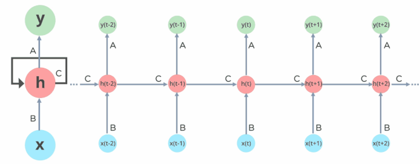

# Yelp Review Classification

This code provides an implementation of a recurrent neural network (RNN) in `Pytorch` for sentiment analysis on Yelp reviews.  
It first preprocesses the data, converting text reviews into numerical input vectors for the neural network. The vocabulary of the reviews is initialized, and words that occur less than a certain number of times are removed. The RNN is then trained using the input vectors and their associated labels (positive or negative sentiment). 
The architecture consists of an input layer, a hidden layer, and an output layer. The hidden layer uses a $tanh$ activation function, and the output layer uses a sigmoid activation function. The training is done using back-propagation a manually written gradient descent. Finally, the trained model is used to make predictions on new reviews, where the review is vectorized and passed through the trained neural network to get a prediction of its sentiment (positive or negative). 
[Run the Code!](#running-the-code)

## Preprocessing
Before any type of data manipulation, it's necessary to define a function that allows the neural network to accept variable length text as input.

The `vectorize()` function is used to convert a review text into a one-hot encoded matrix representation that can be inputted into the RNN model.

It first splits the input into individual tokens, filtering out any tokens that are punctuation. For each non-punctuation token, the function generates a one-hot encoded vector with a length equal to the size of the vocabulary (i.e. the number of unique tokens in the corpus) and sets the index corresponding to the token to 1.

The function then concatenates all of the generated one-hot vectors horizontally to create a matrix representation of the input review. Finally, the function returns the one-hot encoded matrix.

## RNN Implementation
While the architecture is straightforward, the forward propagation, parameter update, and loss function have all been implemented manually. 
The idea is to use `Pytorch` in a granular fashion, relying on it for back-propagation, but everything else done without it.

First, the architecture of the RNN is defined by initializing the parameters for the input layer (`Wx`), the hidden layer (`Wh`), and the output layer (`Wy`). The forward propagation is defined using two functions: `stepForward()` for processing each individual token in a review, and `fullForwardRNN()` for processing a whole review. The `computeForward()` function applies `fullForwardRNN()` across all reviews in the input data-frame.

Next, the loss and accuracy functions are defined. The `computeLoss()` function calculates the binary cross-entropy loss between the predicted output and the actual output, where the predicted output is passed through the sigmoid activation function. The `computeAccuracy()` function calculates the classification accuracy between the predicted output and the actual output.

Finally, the `updateParams()` function is defined to update the parameters using the gradients calculated during back-propagation. The update is done using stochastic gradient descent (SGD) with a given learning rate.

## Discussion of Results
As mentioned in the code, the datasets must remain relatively small due to computational limits. Pivotal improvements could be done by using `Pytorch` as-is, to take advantage of GPU memory.

The results themselves are mixed, but promising. The loss of the training and validation set both plateau after ~100-150 epochs, with the validation loss eventually converging towards the end.
This indicates the model is successfully minimising the loss functions.

However, the accuracy on the training set is 50%, no better than random chance. Given that the architecture dynamically allocates its width depending on the size of the training set, this indicates its an issue with the quantity of data. We simply need much more of it, but there are computational limits within Google Colab.

Imbalances in the training/validation sets lead to better results, but that defeats the purpose.

## Running the Code
To use this source code, you need to run the entire [`RNN_YELP`](RNN_YELP.ipynb) script.
Alternatively, you can view my [notebook](RNN_YELP.ipynb) as-is, or run it directly in [Google Colab](https://colab.research.google.com/github/Alexis-Georganopoulos/Sentiment_Classifier/blob/main/RNN_YELP.ipynb).
The source code is self-contained but requires one additional source file(the `reviews.csv`). Any other dataset of reviews will also suffice.
 Once you run the script, the output will display the loss and accuracy of the model, as well as some samples of the training set . The RNN model will be defined and ready to train.
